# The Ray Tracer Challenge in C.

## Chapter 5

## Chapter 6
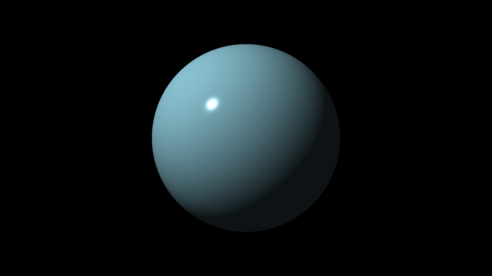

## Chapter 7
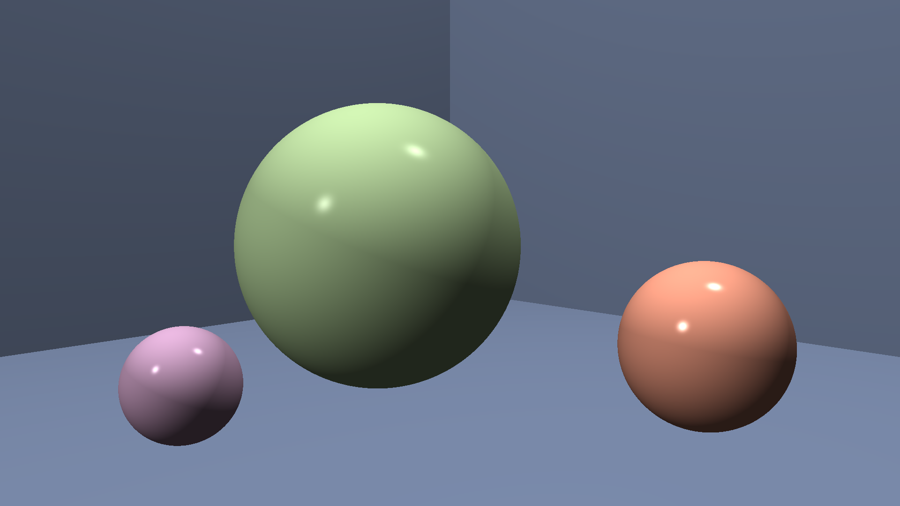

## Chapter 8
The same scene from Chapter 7 was rendered with shadows using 2 point light sources.
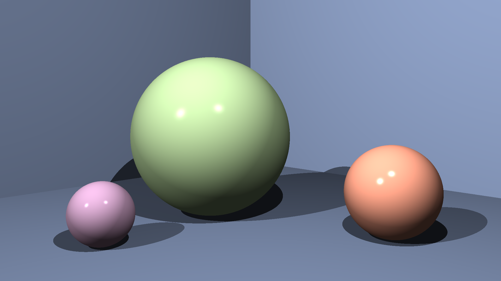

## Chapter 9
A scene renderer with planes for the floor and the walls.
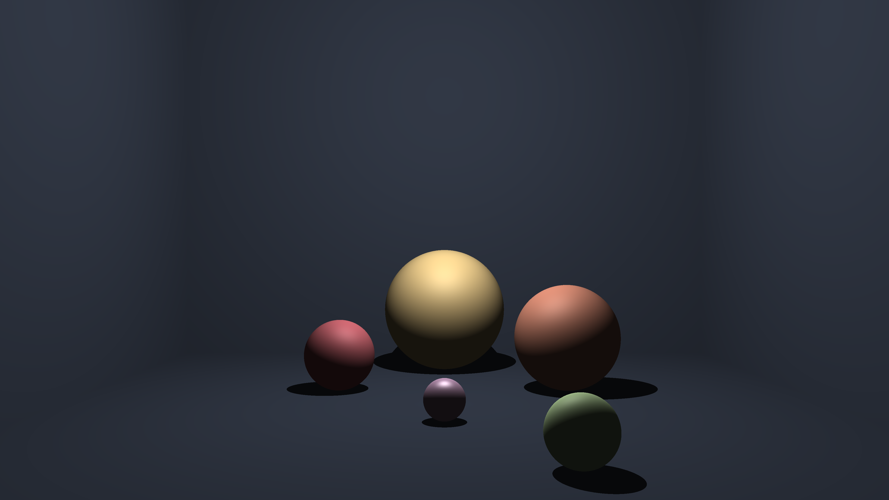

## Chapter 10
Patterns. Only used gradient and checker patterns for this scene, but
stripes and ring patterns are available too.
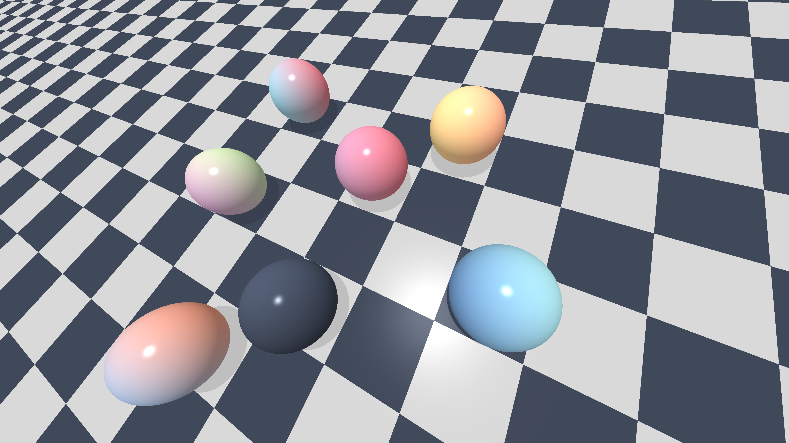

## Chapter 11
Reflection and refraction. Scene with reflection only :
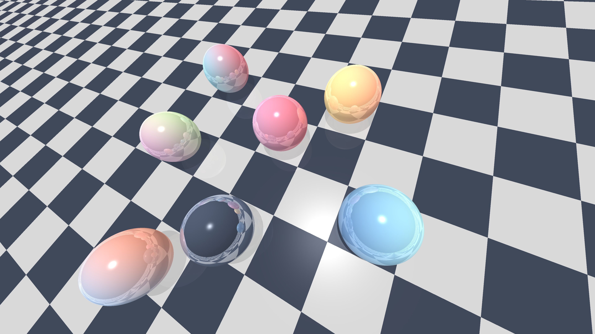

Scene with reflection and refraction :
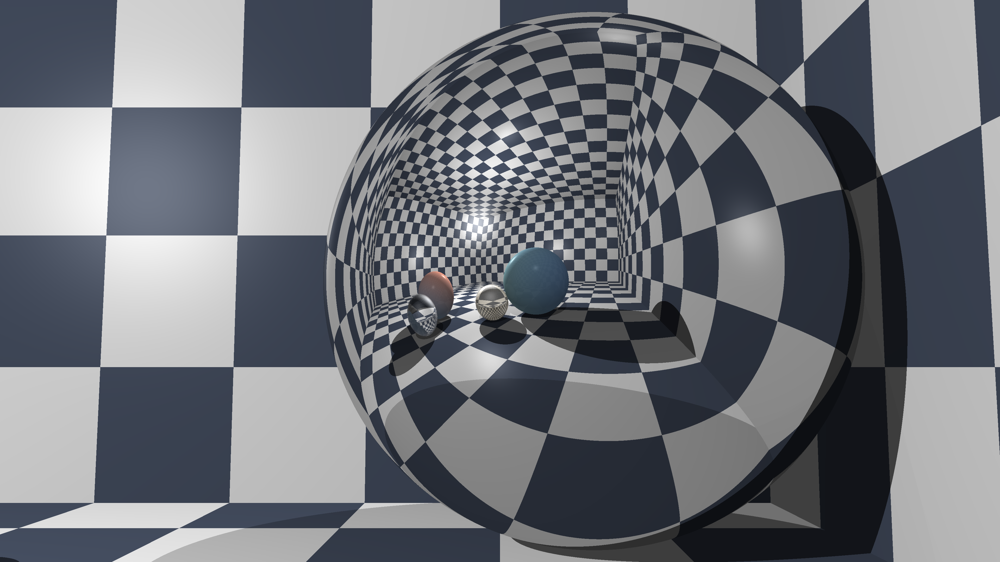

## Chapter 12
A scene with cubes.
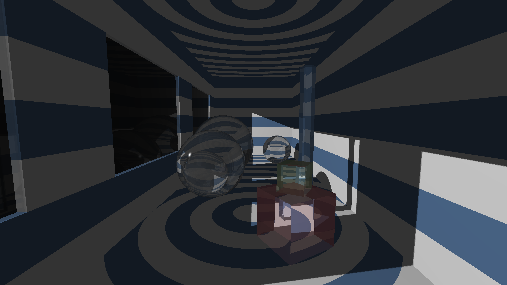

## Chapter 13
Cylinders and cones. Some of the patterns don't seem to work very well in 3D 
(for example, the ring and checker patterns are very noisy in 3D).
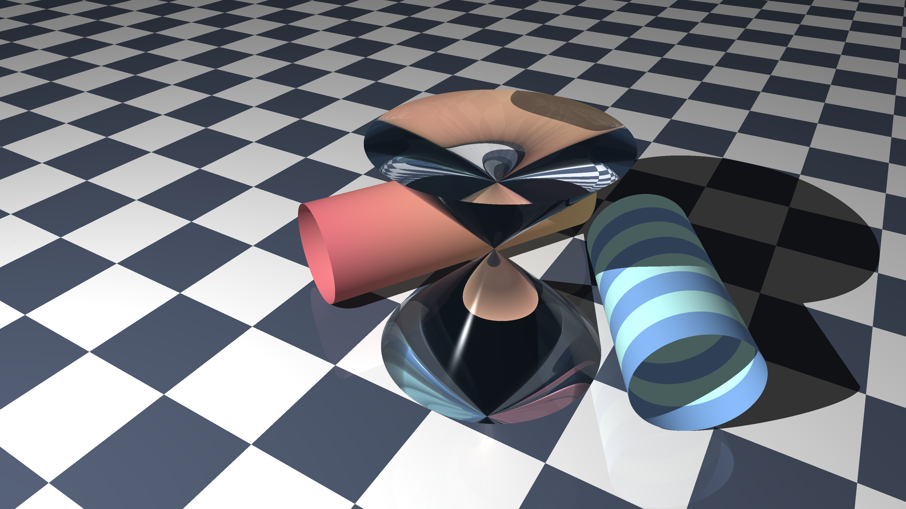

## Chapter 14
Groups.
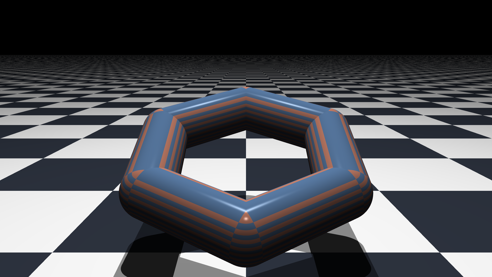

## Bounding boxes
1000 reflective spheres rendered with bounding boxes around groups. 100
groups were used (I think) to render this image in 233.74 seconds, resolution of
3840x2160 pixels (single threaded).
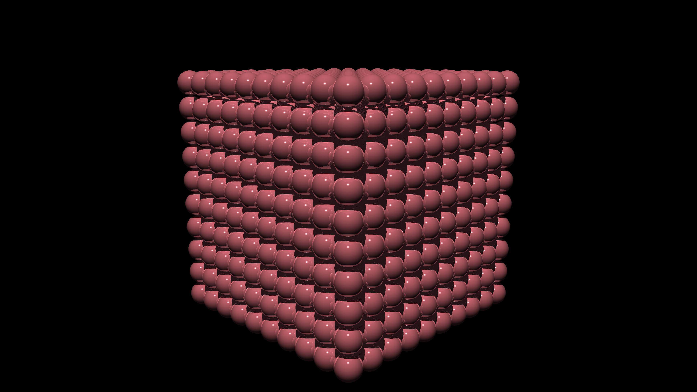

## Bounding Volume Hierarchy
Same scene as the previous one, this time with BVH. Image rendered in 255.77
seconds. It is a bit slower compared to the previous iteration. My guess is
that I manually managed to create a better hierarchy than the automatic BVH
implementation that I built. Also, there's overhead with creating a BVH, which
might of contributed to the slowdown. However, it was much easier to build this
scene programmatically, which is good I guess.

Without BVH, this scene rendered about 7.727 times slower.

## Soft shadows and area lights
Scene with an area light and soft shadows.
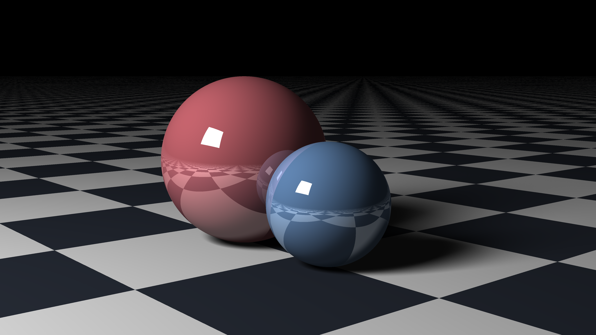
